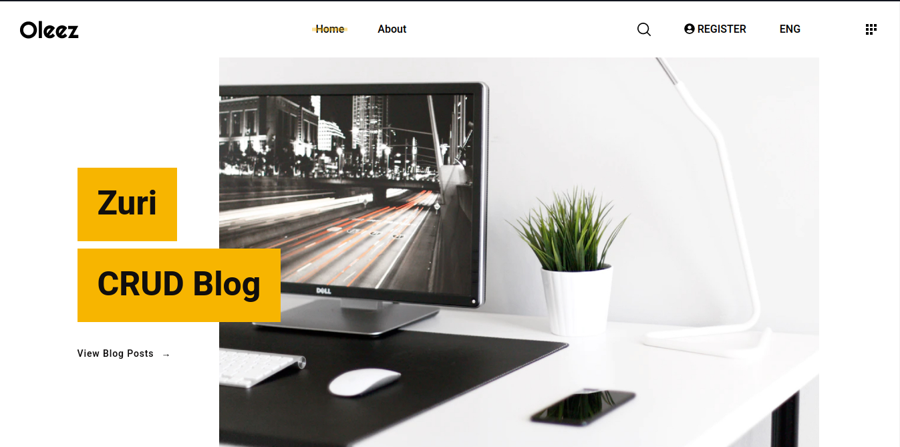

# <b>Zuri-CRUD-Blog</b>

#### This is a blog extending our previous class on Django CRUD Operations.

 

## <b>UI Preview</b>

 

## <b>Features Implemented:</b>
- register
- login
- password reset
- logout
- comment

 

## <b>Platform Hosted</b>
- Heroku: https://zuri-crud-blog.herokuapp.com/

 

## <b>ER Diagram</b>

#### An Entity Relationship (ER) Diagram is a type of flowchart that illustrates how "entities" such as people, objects or concepts relate to each other within a system. ER Diagrams are most often used to design or debug relational databases in the fields of software engineering, business information systems, education and research.

 

 

## <b>How To Run:</b>

### To get it running on your local machine, follow the steps below:

 

1. Run the commands below in your terminal:

> https://github.com/israelvictory/Zuri-CRUD-Blog.git

 
2. Change directory to zuri:

> cd Zuri-CRUD-Blog/zuri

 
3. Create a virtual environment adn Install the requirements with the command below:

> virtualenv env

> source env/bin/activate - Linux / Mac

> env/Scripts/activate.bat - Windows

> pip install -r requirements.txt

 
4. Run the development server with

> python manage.py runserver

 
5. Launch your browser and navigate to:

> http://127.0.0.1:8000

